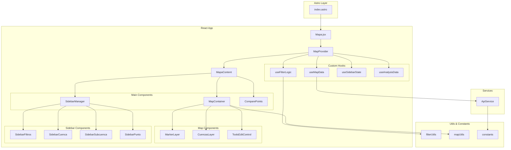
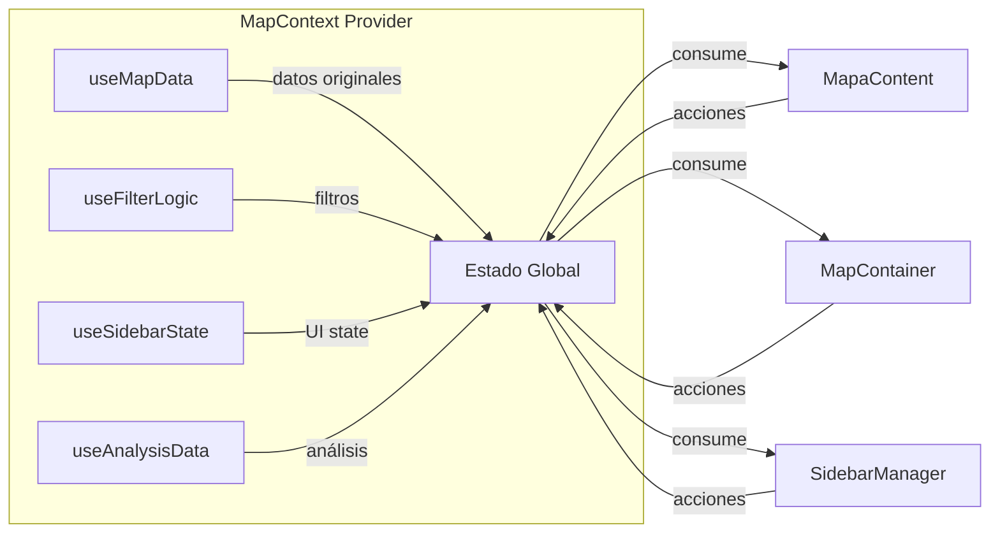
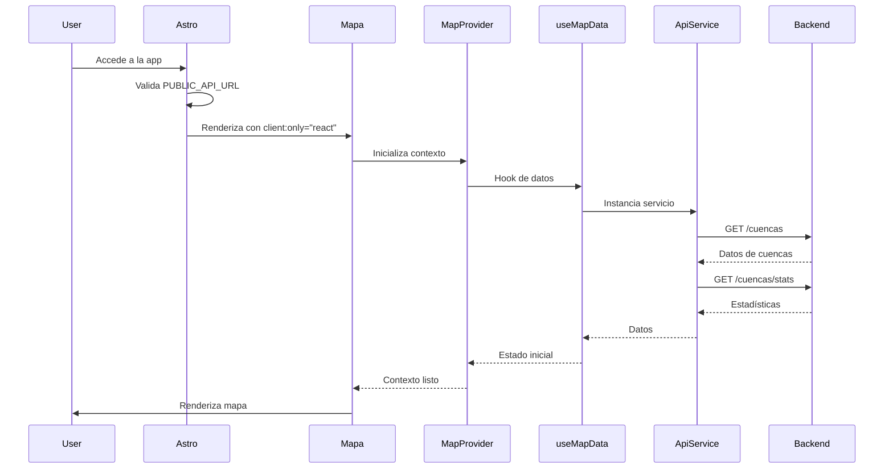
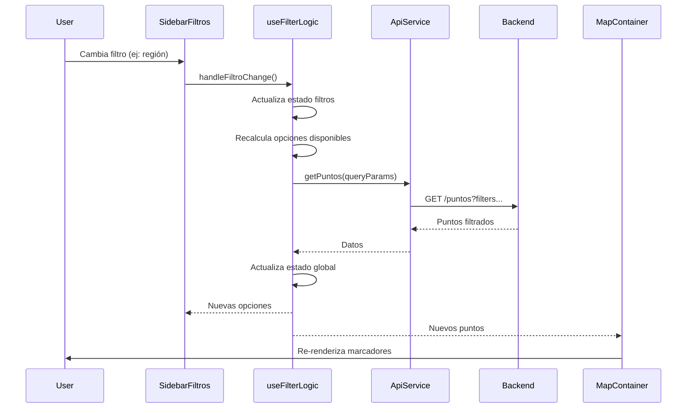
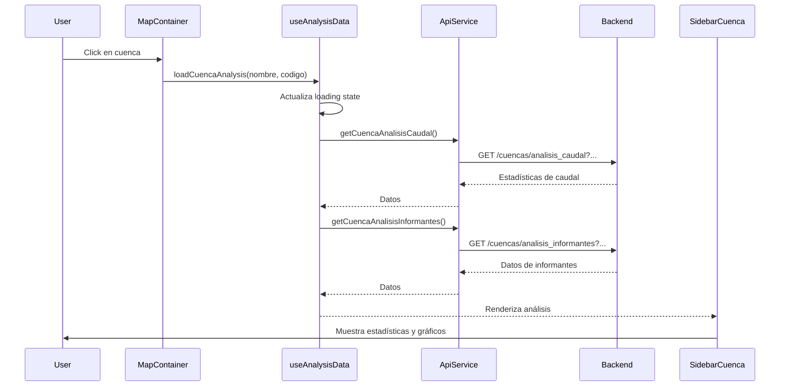
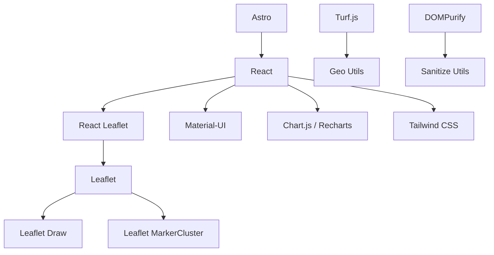

# 🏗️ Arquitectura del Proyecto

Este documento describe la arquitectura del frontend de Aguas Transparentes, sus patrones de diseño, flujo de datos y decisiones técnicas.

## Tabla de Contenidos

- [Visión General](#visión-general)
- [Diagrama de Arquitectura](#diagrama-de-arquitectura)
- [Estructura de Carpetas](#estructura-de-carpetas)
- [Flujo de Datos](#flujo-de-datos)
- [Patrones de Diseño](#patrones-de-diseño)
- [Capas de la Aplicación](#capas-de-la-aplicación)
- [Decisiones Arquitectónicas](#decisiones-arquitectónicas)

---

## Visión General

La aplicación utiliza una **arquitectura de capas modular** que separa responsabilidades y facilita el mantenimiento:

```
┌─────────────────────────────────────────────┐
│           Astro (SSG/SSR)                   │
│     index.astro (Entry Point)               │
└─────────────────┬───────────────────────────┘
                  │
┌─────────────────▼───────────────────────────┐
│         React Components                    │
│     (Client-Side Rendering)                 │
│                                             │
│  ┌───────────────────────────────────────┐ │
│  │      MapProvider (Context API)        │ │
│  │   ┌─────────────────────────────┐     │ │
│  │   │    Custom Hooks Layer       │     │ │
│  │   │  - useMapData               │     │ │
│  │   │  - useFilterLogic           │     │ │
│  │   │  - useSidebarState          │     │ │
│  │   │  - useAnalysisData          │     │ │
│  │   └────────┬────────────────────┘     │ │
│  │            │                           │ │
│  │   ┌────────▼────────────────────┐     │ │
│  │   │   Service Layer             │     │ │
│  │   │   - ApiService              │     │ │
│  │   └────────┬────────────────────┘     │ │
│  └────────────┼────────────────────────── │ │
└───────────────┼───────────────────────────┘
                │
┌───────────────▼───────────────────────────┐
│           Backend API (REST)              │
│     https://aguatrasparenteapi...         │
└───────────────────────────────────────────┘
```

## Diagrama de Arquitectura

### Arquitectura de Componentes



### Flujo de Estado con Context API



## Estructura de Carpetas

```
src/
├── components/               # Componentes React
│   ├── map/                  # Componentes específicos del mapa
│   │   ├── MapContainer.jsx      # Contenedor principal del mapa
│   │   ├── MarkerLayer.jsx       # Capa de marcadores
│   │   ├── CuencasLayer.jsx      # Capas de cuencas
│   │   ├── SidebarManager.jsx    # Gestión de sidebars
│   │   └── ComparePointsSelector.jsx
│   │
│   ├── sidebars/             # Paneles laterales
│   │   ├── SidebarFiltros.jsx    # Filtros principales
│   │   ├── SidebarCuenca.jsx     # Análisis de cuenca
│   │   ├── SidebarSubcuenca.jsx  # Análisis de subcuenca
│   │   ├── SidebarPunto.jsx      # Análisis de punto
│   │   └── FilterSection.jsx     # Secciones de filtro
│   │
│   ├── charts/               # Componentes de gráficos
│   │   ├── BarChart.jsx
│   │   ├── LineChart.jsx
│   │   └── ...
│   │
│   ├── ui/                   # Componentes UI reutilizables
│   │   ├── LoadingSpinner.jsx
│   │   ├── StatusButton.jsx
│   │   ├── FilterGroup.jsx
│   │   └── CustomSwitch.jsx
│   │
│   ├── UI/                   # Componentes legacy (capitalizado)
│   │   ├── Leyend.jsx
│   │   └── EstadisticBox.jsx
│   │
│   ├── Popups/               # Popups del mapa
│   │   ├── PopupPunto.jsx
│   │   └── ...
│   │
│   ├── modals/               # Modales
│   │   └── ComparePointsModal.jsx
│   │
│   ├── tools/                # Herramientas interactivas
│   │   └── ToolsEditControl.jsx
│   │
│   ├── navigation/           # Navegación
│   │   └── ...
│   │
│   ├── Buttons/              # Botones
│   │   └── ...
│   │
│   ├── Mapa.jsx              # Componente raíz del mapa
│   └── ...
│
├── contexts/                 # Context API
│   └── MapContext.jsx        # Contexto global del mapa
│
├── hooks/                    # Custom React Hooks
│   ├── useMapData.js         # Hook de datos del mapa
│   ├── useFilterLogic.js     # Hook de lógica de filtros
│   ├── useSidebarState.js    # Hook de estado de sidebars
│   └── useAnalysisData.js    # Hook de datos de análisis
│
├── services/                 # Capa de servicios
│   └── apiService.js         # Servicio de API REST
│
├── utils/                    # Utilidades
│   ├── filterUtils.js        # Utilidades de filtrado
│   ├── mapUtils.js           # Utilidades del mapa
│   ├── geoCalculos.js        # Cálculos geoespaciales
│   ├── utmConverter.js       # Conversión de coordenadas
│   ├── sanitize.js           # Sanitización de datos
│   ├── dateValidation.js     # Validación de fechas
│   ├── fechasPredefinidas.js # Manejo de fechas
│   ├── formatNumberCL.js     # Formato de números chilenos
│   └── dataOptimization.js   # Optimización de datos
│
├── constants/                # Constantes y configuraciones
│   ├── apiEndpoints.js       # Endpoints de la API
│   ├── mapConfig.js          # Configuración del mapa
│   ├── regionesChile.js      # Regiones de Chile
│   └── uiConfig.js           # Configuración de UI
│
├── pages/                    # Páginas Astro
│   └── index.astro           # Página principal
│
└── styles/                   # Estilos globales
    └── global.css            # CSS global
```

### Explicación de la Estructura

#### 📦 **components/** - Componentes React
- **map/**: Componentes específicos del mapa Leaflet
- **sidebars/**: Todos los paneles laterales y filtros
- **charts/**: Componentes de visualización de datos (Chart.js, Recharts)
- **ui/**: Componentes reutilizables de interfaz
- **Popups/**: Popups informativos del mapa
- **modals/**: Ventanas modales
- **tools/**: Herramientas de interacción (dibujo, etc.)

#### 🎣 **hooks/** - Custom Hooks
Lógica de negocio extraída en hooks reutilizables:
- `useMapData`: Carga inicial de datos y gestión de API
- `useFilterLogic`: Lógica compleja de filtrado
- `useSidebarState`: Estados de visibilidad de sidebars
- `useAnalysisData`: Datos de análisis de cuencas/puntos

#### 🔌 **services/** - Capa de Servicios
- `ApiService`: Clase que encapsula todas las llamadas a la API REST

#### 🛠️ **utils/** - Funciones Utilitarias
Funciones puras reutilizables para:
- Filtrado y manipulación de datos
- Cálculos geoespaciales (Turf.js)
- Conversión de coordenadas UTM
- Sanitización y validación
- Formato de datos

#### 📋 **constants/** - Configuraciones Centralizadas
- Endpoints de API
- Configuración de mapas (zoom, center, etc.)
- Datos estáticos (regiones, tipos de punto)
- Configuración de UI

## Flujo de Datos

### 1. Inicialización de la Aplicación



### 2. Flujo de Filtrado



### 3. Flujo de Análisis de Cuenca



## Patrones de Diseño

### 1. Context API + Custom Hooks

**Patrón:** Separation of Concerns + Hooks Pattern

**Implementación:**
```javascript
// MapContext.jsx
export const MapProvider = ({ children, apiUrl }) => {
  const mapData = useMapData(apiUrl);
  const filterLogic = useFilterLogic(...);
  const sidebarState = useSidebarState();
  const analysisData = useAnalysisData(...);

  return (
    <MapContext.Provider value={{...mapData, ...filterLogic, ...sidebarState, ...analysisData}}>
      {children}
    </MapContext.Provider>
  );
};
```

**Ventajas:**
- ✅ Lógica separada en hooks reutilizables
- ✅ Estado global sin prop drilling
- ✅ Fácil testing de hooks individuales
- ✅ Claridad en responsabilidades

### 2. Service Layer Pattern

**Patrón:** Abstracción de servicios externos

**Implementación:**
```javascript
// apiService.js
class ApiService {
  constructor(baseUrl, timeout = 30000) {
    this.baseUrl = baseUrl;
    this.timeout = timeout;
  }

  async request(endpoint, options = {}) {
    // Lógica centralizada: timeout, headers, error handling
  }

  async getCuencas() {
    return this.request(API_ENDPOINTS.CUENCAS);
  }
}
```

**Ventajas:**
- ✅ Punto único de integración con API
- ✅ Manejo consistente de errores
- ✅ Timeout y retry logic centralizados
- ✅ Fácil mockear en tests

### 3. Component Composition

**Patrón:** Composición sobre herencia

**Implementación:**
```javascript
// Componentes pequeños y enfocados
<MapContainer>
  <MarkerLayer />
  <CuencasLayer />
  <ToolsEditControl />
</MapContainer>

<SidebarManager>
  <SidebarFiltros />
  <SidebarCuenca />
  <SidebarSubcuenca />
  <SidebarPunto />
</SidebarManager>
```

**Ventajas:**
- ✅ Componentes reutilizables
- ✅ Fácil mantenimiento
- ✅ Testeable individualmente

### 4. Container/Presentational Pattern

**Patrón:** Separación de lógica y presentación

**Ejemplo:**
- **Container:** `MapaContent` - Maneja lógica, estado, callbacks
- **Presentational:** `MapContainer` - Solo renderiza UI con props

### 5. Render Props / Callback Pattern

**Patrón:** Inversión de control para eventos

**Implementación:**
```javascript
<MapContainer
  onShowSidebarCuencas={handleShowSidebarCuencas}
  onShowSidebarPunto={handleShowSidebarPunto}
/>
```

## Capas de la Aplicación

### Capa 1: Presentación (UI)
**Responsabilidad:** Renderizar interfaz, capturar eventos de usuario

**Componentes:**
- `MapContainer.jsx`
- `SidebarFiltros.jsx`
- `SidebarCuenca.jsx`
- Todos los componentes en `components/ui/`

### Capa 2: Lógica de Negocio (Hooks)
**Responsabilidad:** Gestionar estado, lógica de filtrado, cálculos

**Hooks:**
- `useMapData.js`
- `useFilterLogic.js`
- `useAnalysisData.js`
- `useSidebarState.js`

### Capa 3: Servicios (API)
**Responsabilidad:** Comunicación con backend, manejo de errores

**Servicios:**
- `ApiService` clase

### Capa 4: Utilidades
**Responsabilidad:** Funciones puras reutilizables

**Utils:**
- `filterUtils.js`
- `mapUtils.js`
- `geoCalculos.js`
- etc.

### Capa 5: Configuración
**Responsabilidad:** Constantes, endpoints, configuraciones

**Constants:**
- `apiEndpoints.js`
- `mapConfig.js`
- `regionesChile.js`

## Decisiones Arquitectónicas

### ¿Por qué Astro + React?

**Decisión:** Usar Astro como framework principal con React para componentes interactivos

**Razones:**
1. **Rendimiento:** Astro genera HTML estático, solo hidrata React donde es necesario
2. **SEO-friendly:** Mejor para indexación y tiempo de carga inicial
3. **Flexibilidad:** Permite usar React solo en componentes que lo necesitan (`client:only`)
4. **DX:** Simplicidad de Astro + poder de React

### ¿Por qué Context API en lugar de Redux?

**Decisión:** Usar Context API + Custom Hooks

**Razones:**
1. **Simplicidad:** No requiere librería externa ni boilerplate
2. **Suficiente:** El estado de la app no es extremadamente complejo
3. **Hooks:** Se integra naturalmente con el paradigma de hooks
4. **Performance:** Con hooks bien diseñados, no hay problemas de re-renders

**Trade-off:** Para apps más grandes, Redux podría ofrecer mejor debugging y middleware

### ¿Por qué Leaflet en lugar de Google Maps?

**Decisión:** Usar Leaflet

**Razones:**
1. **Open Source:** Sin costos de licencia
2. **Flexible:** Altamente personalizable
3. **Ecosistema:** Muchos plugins (draw, cluster, etc.)
4. **Control:** Total control sobre capas y datos

### ¿Por qué un ApiService centralizado?

**Decisión:** Clase ApiService en lugar de fetch directo

**Razones:**
1. **DRY:** Evita duplicar lógica de fetch, headers, error handling
2. **Mantenibilidad:** Cambios en la API se hacen en un solo lugar
3. **Testing:** Fácil mockear el servicio completo
4. **Seguridad:** Timeout, validación, sanitización centralizados

### ¿Por qué Custom Hooks especializados?

**Decisión:** Dividir lógica en múltiples hooks (`useMapData`, `useFilterLogic`, etc.)

**Razones:**
1. **Separation of Concerns:** Cada hook tiene una responsabilidad clara
2. **Reusabilidad:** Hooks pueden usarse en otros contextos
3. **Testing:** Más fácil testear lógica aislada
4. **Legibilidad:** Código más limpio y entendible

**Alternativa descartada:** Un solo hook gigante con toda la lógica

### ¿Por qué Tailwind CSS?

**Decisión:** Usar Tailwind CSS como framework principal

**Razones:**
1. **Desarrollo rápido:** Utility-first permite iterar rápido
2. **Consistencia:** Sistema de diseño integrado
3. **Bundle pequeño:** Tree-shaking automático
4. **DX:** Excelente integración con VSCode

**Combinado con:** Material-UI para componentes complejos (selects, switches)

## Diagrama de Dependencias



## Próximos Pasos Arquitectónicos (Recomendaciones)

1. **Testing:** Implementar tests unitarios para hooks y utils
2. **Code Splitting:** Lazy loading de sidebars y charts
3. **State Management:** Considerar Zustand si el estado crece mucho
4. **Performance:** Memoización de componentes pesados
5. **Error Boundaries:** Agregar boundaries para manejo de errores React
6. **Analytics:** Integrar tracking de eventos de usuario
7. **Offline Support:** Service Worker para funcionamiento sin conexión

---

**Última actualización:** Noviembre 2025
