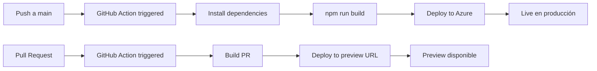

# 🚀 Guía de Deployment

Esta guía describe el proceso de despliegue del frontend de **Aguas Transparentes** en Azure Static Web Apps.

## Tabla de Contenidos

- [Plataforma de Hosting](#plataforma-de-hosting)
- [Prerrequisitos](#prerrequisitos)
- [Configuración de Azure](#configuración-de-azure)
- [Build para Producción](#build-para-producción)
- [Variables de Entorno](#variables-de-entorno)
- [CI/CD Pipeline](#cicd-pipeline)
- [Headers de Seguridad](#headers-de-seguridad)
- [Dominios Personalizados](#dominios-personalizados)
- [Monitoreo](#monitoreo)
- [Rollback](#rollback)

---

## Plataforma de Hosting

El proyecto está configurado para desplegarse en **Azure Static Web Apps**.

### ¿Por qué Azure Static Web Apps?

- ✅ **Hosting optimizado** para aplicaciones Astro/React
- ✅ **CI/CD integrado** con GitHub Actions
- ✅ **CDN global** para baja latencia
- ✅ **HTTPS automático** y certificados SSL
- ✅ **Preview environments** para pull requests
- ✅ **Configuración de headers** de seguridad
- ✅ **Routing SPA** nativo

### Alternativas

El proyecto también puede desplegarse en:
- **Vercel** (requiere configuración mínima)
- **Netlify** (requiere configuración mínima)
- **Cloudflare Pages**
- **AWS S3 + CloudFront**

---

## Prerrequisitos

### Cuentas Necesarias

1. **Cuenta de Azure**
   - Suscripción activa
   - Acceso al portal de Azure

2. **Cuenta de GitHub**
   - Repositorio del proyecto
   - Permisos de administrador para GitHub Actions

### Software Local

- Node.js >= 18.0.0
- npm >= 9.0.0
- Git
- Azure CLI (opcional)

---

## Configuración de Azure

### Paso 1: Crear Azure Static Web App

#### Vía Portal de Azure

1. **Acceder al Portal**
   - Navega a [portal.azure.com](https://portal.azure.com)
   - Inicia sesión con tu cuenta

2. **Crear Recurso**
   - Haz clic en "Create a resource"
   - Busca "Static Web Apps"
   - Haz clic en "Create"

3. **Configuración Básica**
   ```
   Subscription: [Tu suscripción]
   Resource Group: [Crear o seleccionar]
   Name: aguas-transparentes-frontend
   Plan type: Free o Standard
   Region: East US 2 (o la más cercana)
   ```

4. **Integración con GitHub**
   ```
   Source: GitHub
   Organization: [Tu organización]
   Repository: frontend-aguas
   Branch: main
   ```

5. **Build Details**
   ```
   Build Presets: Astro
   App location: /
   Api location: (dejar vacío)
   Output location: dist
   ```

6. **Review + Create**
   - Revisa la configuración
   - Haz clic en "Create"

Azure creará automáticamente:
- El recurso Static Web App
- Un GitHub Action workflow en tu repositorio
- Un preview environment

#### Vía Azure CLI

```bash
# Login a Azure
az login

# Crear resource group
az group create \
  --name aguas-transparentes-rg \
  --location eastus2

# Crear Static Web App
az staticwebapp create \
  --name aguas-transparentes-frontend \
  --resource-group aguas-transparentes-rg \
  --source https://github.com/TU_ORG/frontend-aguas \
  --location eastus2 \
  --branch main \
  --app-location "/" \
  --output-location "dist" \
  --login-with-github
```

### Paso 2: Verificar GitHub Action

Azure crea automáticamente un workflow en `.github/workflows/azure-static-web-apps-<nombre>.yml`.

**Ejemplo de workflow generado:**

```yaml
name: Azure Static Web Apps CI/CD

on:
  push:
    branches:
      - main
  pull_request:
    types: [opened, synchronize, reopened, closed]
    branches:
      - main

jobs:
  build_and_deploy_job:
    if: github.event_name == 'push' || (github.event_name == 'pull_request' && github.event.action != 'closed')
    runs-on: ubuntu-latest
    name: Build and Deploy Job
    steps:
      - uses: actions/checkout@v3
        with:
          submodules: true

      - name: Build And Deploy
        id: builddeploy
        uses: Azure/static-web-apps-deploy@v1
        with:
          azure_static_web_apps_api_token: ${{ secrets.AZURE_STATIC_WEB_APPS_API_TOKEN }}
          repo_token: ${{ secrets.GITHUB_TOKEN }}
          action: "upload"
          app_location: "/"
          api_location: ""
          output_location: "dist"

  close_pull_request_job:
    if: github.event_name == 'pull_request' && github.event.action == 'closed'
    runs-on: ubuntu-latest
    name: Close Pull Request Job
    steps:
      - name: Close Pull Request
        id: closepullrequest
        uses: Azure/static-web-apps-deploy@v1
        with:
          azure_static_web_apps_api_token: ${{ secrets.AZURE_STATIC_WEB_APPS_API_TOKEN }}
          action: "close"
```

---

## Build para Producción

### Configuración de Build

El proyecto usa Astro con configuración optimizada para producción.

**astro.config.mjs:**
```javascript
export default defineConfig({
  integrations: [react()],
  vite: {
    plugins: [tailwindcss()],
    build: {
      rollupOptions: {
        output: {
          manualChunks: undefined,
        },
      },
    },
  },
});
```

### Comandos de Build

```bash
# Build local (testing)
npm run build

# Previsualizar build
npm run preview

# Limpiar caché y rebuild
rm -rf dist node_modules/.astro
npm run build
```

### Optimizaciones de Build

1. **Code Splitting**
   - Astro automáticamente divide el código por páginas
   - React components son lazy-loaded cuando sea posible

2. **Asset Optimization**
   - Imágenes optimizadas automáticamente
   - CSS minificado
   - JavaScript minificado

3. **Tailwind CSS Purge**
   - Clases no usadas son removidas automáticamente

### Verificar Build

**Checklist antes de deploy:**

```bash
# 1. Build sin errores
npm run build
# ✅ Output en dist/

# 2. Tamaño del bundle
du -sh dist/
# ✅ Debe ser < 10MB

# 3. Preview funciona
npm run preview
# ✅ Navega a http://localhost:4321

# 4. No hay console.logs en producción
grep -r "console.log" dist/
# ✅ Solo logs necesarios

# 5. Variables de entorno configuradas
cat .env
# ✅ PUBLIC_API_URL configurada
```

---

## Variables de Entorno

### Configuración en Azure

1. **Portal de Azure**
   - Navega a tu Static Web App
   - Selecciona "Configuration" en el menú lateral
   - Haz clic en "Application settings"

2. **Agregar Variable**
   ```
   Name: PUBLIC_API_URL
   Value: https://aguatrasparenteapi-h2d4gvbcfvcjfycr.eastus2-01.azurewebsites.net
   ```

3. **Guardar**
   - Haz clic en "Save"
   - La app se redesplegará automáticamente

### Variables Disponibles

| Variable | Descripción | Ejemplo |
|----------|-------------|---------|
| `PUBLIC_API_URL` | URL del backend API | `https://api.ejemplo.com` |

### Diferentes Entornos

#### Production
```bash
PUBLIC_API_URL="https://aguatrasparenteapi-h2d4gvbcfvcjfycr.eastus2-01.azurewebsites.net"
```

#### Staging (Preview Environments)
```bash
PUBLIC_API_URL="https://staging-api.ejemplo.com"
```

**Nota:** Azure Static Web Apps crea automáticamente preview environments para cada PR.

---

## CI/CD Pipeline

### Flujo de Deployment



### Proceso de Deployment

1. **Trigger:**
   - Push a `main` → Deploy a producción
   - PR abierto/actualizado → Deploy a preview environment

2. **Build Process:**
   ```bash
   npm install
   npm run build
   ```

3. **Upload:**
   - Archivos en `dist/` se suben a Azure
   - CDN se invalida automáticamente

4. **Validación:**
   - Health check automático
   - Tests de smoke (si están configurados)

### Preview Environments

Cada Pull Request obtiene su propia URL de preview:

```
https://aguas-transparentes-frontend-<random>.azurestaticapps.net
```

**Características:**
- ✅ URL única por PR
- ✅ Se actualiza con cada commit
- ✅ Se elimina al cerrar el PR
- ✅ Mismo entorno que producción

---

## Headers de Seguridad

### Configuración en staticwebapp.config.json

El proyecto incluye configuración de headers de seguridad:

```json
{
  "globalHeaders": {
    "X-Frame-Options": "DENY",
    "X-Content-Type-Options": "nosniff",
    "X-XSS-Protection": "1; mode=block",
    "Referrer-Policy": "strict-origin-when-cross-origin",
    "Permissions-Policy": "geolocation=(), microphone=(), camera=()",
    "Content-Security-Policy": "default-src 'self'; script-src 'self' 'unsafe-inline' 'unsafe-eval'; ...",
    "Strict-Transport-Security": "max-age=31536000; includeSubDomains",
    "X-Permitted-Cross-Domain-Policies": "none",
    "Cache-Control": "no-store, no-cache, must-revalidate, max-age=0"
  }
}
```

### Headers Explicados

| Header | Propósito | Valor |
|--------|-----------|-------|
| `X-Frame-Options` | Prevenir clickjacking | `DENY` |
| `X-Content-Type-Options` | Prevenir MIME sniffing | `nosniff` |
| `X-XSS-Protection` | Protección XSS del navegador | `1; mode=block` |
| `Strict-Transport-Security` | Forzar HTTPS | `max-age=31536000` |
| `Content-Security-Policy` | Controlar recursos permitidos | Ver config completa |

### Verificar Headers

```bash
# Verificar headers en producción
curl -I https://tu-app.azurestaticapps.net

# Deberías ver:
# X-Frame-Options: DENY
# X-Content-Type-Options: nosniff
# ...
```

---

## Dominios Personalizados

### Agregar Dominio Personalizado

1. **En Azure Portal:**
   - Navega a tu Static Web App
   - Selecciona "Custom domains"
   - Haz clic en "Add"

2. **Configurar DNS:**
   ```
   Type: CNAME
   Name: www
   Value: <tu-app>.azurestaticapps.net
   ```

3. **Validar:**
   - Azure valida automáticamente el DNS
   - Genera certificado SSL gratuito

4. **Esperar Propagación:**
   - Puede tomar hasta 48 horas
   - Usualmente menos de 1 hora

### Ejemplo

```
Domain: www.aguastransparentes.cl
CNAME: aguas-transparentes-frontend.azurestaticapps.net
```

---

## Monitoreo

### Azure Application Insights

1. **Habilitar:**
   - Navega a tu Static Web App
   - Selecciona "Application Insights"
   - Haz clic en "Enable"

2. **Métricas Disponibles:**
   - Requests por segundo
   - Tiempo de respuesta
   - Errores 4xx/5xx
   - Tráfico por región
   - Performance del cliente

### Logs

**Ver logs de deployment:**

```bash
# En el portal de Azure
Static Web App → Deployment history → Ver logs
```

**Ver logs de aplicación:**

```bash
# Application Insights → Logs
# Queries KQL
```

### Alertas

Configurar alertas para:
- Errores 5xx > threshold
- Tiempo de carga > 3s
- Downtime detection

---

## Rollback

### Vía Azure Portal

1. **Navega a:**
   - Static Web App → Deployment history

2. **Selecciona deployment anterior:**
   - Encuentra la versión estable
   - Haz clic en "Redeploy"

3. **Confirma:**
   - La app volverá a esa versión

### Vía Git

```bash
# 1. Encontrar commit anterior estable
git log --oneline

# 2. Revertir a ese commit
git revert <commit-hash>

# 3. Push a main (trigger redeploy)
git push origin main
```

### Deployment Manual

```bash
# Si GitHub Actions falla, deploy manual con Azure CLI
az staticwebapp deploy \
  --name aguas-transparentes-frontend \
  --resource-group aguas-transparentes-rg \
  --source ./dist
```

---

## Troubleshooting de Deployment

### Error: Build Failed

**Síntoma:**
```
Error: npm run build exited with code 1
```

**Solución:**
1. Verificar que el build funciona localmente:
   ```bash
   npm run build
   ```

2. Verificar versión de Node.js en GitHub Action:
   ```yaml
   - name: Setup Node
     uses: actions/setup-node@v3
     with:
       node-version: '18'
   ```

### Error: Environment Variables Not Found

**Síntoma:**
```
ERROR: PUBLIC_API_URL no está definida
```

**Solución:**
1. Verificar que la variable está configurada en Azure Portal
2. Reiniciar el deployment

### Error: 404 en Rutas

**Síntoma:**
- `/` funciona
- Otras rutas dan 404 al recargar

**Solución:**
Verificar `staticwebapp.config.json`:

```json
{
  "navigationFallback": {
    "rewrite": "/index.html"
  }
}
```

---

## Checklist Pre-Deployment

Antes de hacer deploy a producción:

- [ ] Build local exitoso
- [ ] Tests pasando (si aplican)
- [ ] Variables de entorno configuradas
- [ ] Headers de seguridad configurados
- [ ] Performance verificado en preview
- [ ] No hay console.logs innecesarios
- [ ] Documentación actualizada
- [ ] Changelog actualizado (si aplica)

---

**Última actualización:** Noviembre 2025
