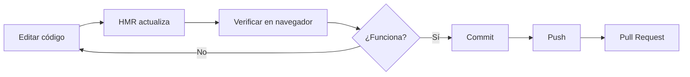

# 👨‍💻 Guía de Desarrollo

Esta guía proporciona las mejores prácticas, convenciones y workflows para desarrollar en el proyecto **Aguas Transparentes Frontend**.

## Tabla de Contenidos

- [Workflow de Desarrollo](#workflow-de-desarrollo)
- [Convenciones de Código](#convenciones-de-código)
- [Estructura de Archivos](#estructura-de-archivos)
- [Agregar Nuevas Funcionalidades](#agregar-nuevas-funcionalidades)
- [Debugging](#debugging)
- [Performance](#performance)
- [Testing](#testing)
- [Git Workflow](#git-workflow)

---

## Workflow de Desarrollo

### Iniciar Desarrollo

```bash
# 1. Asegúrate de estar en la rama correcta
git checkout main
git pull origin main

# 2. Crea una nueva rama para tu feature
git checkout -b feature/nombre-descriptivo

# 3. Inicia el servidor de desarrollo
npm run dev

# 4. Abre el navegador en http://localhost:4321
```

### Hot Module Replacement (HMR)

El proyecto usa **Vite HMR** que permite:
- ✅ Cambios de código se reflejan instantáneamente
- ✅ No pierde el estado de React en la mayoría de los casos
- ✅ Actualización rápida de CSS sin refresh

**Tip:** Si encuentras bugs de estado, haz un hard refresh (`Cmd+Shift+R` / `Ctrl+Shift+F5`)

### Ciclo de Desarrollo



---

## Convenciones de Código

### Nomenclatura

#### Archivos y Carpetas

```
✅ CORRECTO:
- MapContainer.jsx          (PascalCase para componentes)
- useMapData.js             (camelCase para hooks)
- filterUtils.js            (camelCase para utils)
- apiEndpoints.js           (camelCase para constantes)
- SETUP.md                  (UPPERCASE para docs)

❌ INCORRECTO:
- mapcontainer.jsx
- UseMapData.js
- FilterUtils.js
```

#### Variables y Funciones

```javascript
// ✅ CORRECTO - camelCase
const userName = "Juan";
const isLoading = false;
function handleClick() {}
const fetchUserData = async () => {};

// ❌ INCORRECTO
const user_name = "Juan";
const UserName = "Juan";
```

#### Componentes y Clases

```javascript
// ✅ CORRECTO - PascalCase
const MapContainer = () => {};
class ApiService {}

// ❌ INCORRECTO
const mapContainer = () => {};
class apiService {}
```

#### Constantes

```javascript
// ✅ CORRECTO - SCREAMING_SNAKE_CASE para constantes verdaderas
const API_BASE_URL = "https://api.com";
const MAX_ZOOM_LEVEL = 18;

// ✅ CORRECTO - camelCase para objetos de configuración
const mapConfig = { center: [0, 0], zoom: 10 };
```

### Estructura de Componentes

#### Componente Funcional React

```javascript
import React, { useState, useEffect } from 'react';
import PropTypes from 'prop-types'; // Opcional pero recomendado

/**
 * Descripción breve del componente
 * @param {Object} props - Propiedades del componente
 */
const MiComponente = ({ prop1, prop2, onAction }) => {
  // 1. Hooks
  const [state, setState] = useState(null);

  // 2. useEffect
  useEffect(() => {
    // Lógica de efecto
  }, [dependency]);

  // 3. Funciones handlers
  const handleClick = () => {
    onAction();
  };

  // 4. Funciones helpers (si son pequeñas)
  const formatData = (data) => {
    return data.toUpperCase();
  };

  // 5. Early returns
  if (!state) {
    return <div>Cargando...</div>;
  }

  // 6. Render principal
  return (
    <div className="container">
      <h1>{prop1}</h1>
      <button onClick={handleClick}>
        {prop2}
      </button>
    </div>
  );
};

// 7. PropTypes (opcional)
MiComponente.propTypes = {
  prop1: PropTypes.string.isRequired,
  prop2: PropTypes.string,
  onAction: PropTypes.func.isRequired,
};

// 8. Default props (si aplica)
MiComponente.defaultProps = {
  prop2: 'Valor por defecto',
};

export default MiComponente;
```

### Hooks Personalizados

```javascript
// src/hooks/useMiHook.js
import { useState, useEffect } from 'react';

/**
 * Hook personalizado para [descripción]
 * @param {string} param - Descripción del parámetro
 * @returns {Object} Estado y funciones del hook
 */
export const useMiHook = (param) => {
  const [data, setData] = useState(null);
  const [loading, setLoading] = useState(false);
  const [error, setError] = useState(null);

  useEffect(() => {
    // Lógica del hook
  }, [param]);

  return {
    data,
    loading,
    error,
    // Funciones útiles
  };
};
```

### Estilos con Tailwind CSS

```javascript
// ✅ CORRECTO - Clases ordenadas por categoría
<div className="
  flex items-center justify-between
  w-full max-w-4xl
  px-4 py-2
  bg-white
  rounded-lg shadow-md
  hover:shadow-lg
  transition-shadow
">
  Contenido
</div>

// ❌ INCORRECTO - Clases desordenadas
<div className="bg-white flex rounded-lg w-full shadow-md items-center px-4 hover:shadow-lg max-w-4xl py-2 justify-between transition-shadow">
```

**Orden recomendado de clases Tailwind:**
1. Layout (flex, grid, block)
2. Posicionamiento (absolute, relative, top, left)
3. Dimensiones (w-, h-, max-w-)
4. Spacing (p-, m-)
5. Colores (bg-, text-, border-)
6. Tipografía (font-, text-size, leading-)
7. Bordes (border-, rounded-)
8. Efectos (shadow-, opacity-)
9. Estados (hover:, focus:, active:)
10. Transiciones

### Imports

```javascript
// ✅ CORRECTO - Agrupados y ordenados
// 1. Imports de librerías
import React, { useState, useEffect } from 'react';
import { useNavigate } from 'react-router-dom';

// 2. Imports de componentes
import MapContainer from '../map/MapContainer';
import Sidebar from '../sidebars/Sidebar';

// 3. Imports de hooks
import { useMapContext } from '../../contexts/MapContext';
import { useMapData } from '../../hooks/useMapData';

// 4. Imports de utilidades
import { filterData } from '../../utils/filterUtils';
import { API_ENDPOINTS } from '../../constants/apiEndpoints';

// 5. Imports de estilos
import './styles.css';
```

---

## Estructura de Archivos

### Dónde Poner Nuevos Archivos

```
src/
├── components/
│   ├── map/              👈 Componentes específicos del mapa
│   ├── sidebars/         👈 Sidebars y paneles
│   ├── charts/           👈 Componentes de gráficos
│   ├── ui/               👈 Componentes reutilizables genéricos
│   ├── modals/           👈 Ventanas modales
│   └── ...
├── hooks/                👈 Custom hooks reutilizables
├── services/             👈 Servicios externos (API, storage)
├── utils/                👈 Funciones utilitarias puras
├── constants/            👈 Constantes y configuraciones
└── contexts/             👈 Contextos de React
```

### Decisión: ¿Dónde va mi código?

**¿Es un componente visual?** → `components/`
- ¿Es específico del mapa? → `components/map/`
- ¿Es un sidebar? → `components/sidebars/`
- ¿Es un gráfico? → `components/charts/`
- ¿Es reutilizable genérico? → `components/ui/`

**¿Es lógica de negocio reutilizable?** → `hooks/`

**¿Es una función pura utilitaria?** → `utils/`

**¿Es una constante o configuración?** → `constants/`

**¿Es comunicación con API?** → `services/`

---

## Agregar Nuevas Funcionalidades

### 1. Agregar un Nuevo Componente

**Ejemplo:** Agregar un componente de alerta

```bash
# 1. Crear archivo
touch src/components/ui/Alert.jsx

# 2. Implementar componente
```

```javascript
// src/components/ui/Alert.jsx
import React from 'react';

const Alert = ({ type = 'info', message, onClose }) => {
  const typeColors = {
    info: 'bg-blue-100 text-blue-800 border-blue-300',
    success: 'bg-green-100 text-green-800 border-green-300',
    warning: 'bg-yellow-100 text-yellow-800 border-yellow-300',
    error: 'bg-red-100 text-red-800 border-red-300',
  };

  return (
    <div className={`
      flex items-center justify-between
      px-4 py-3
      border rounded-lg
      ${typeColors[type]}
    `}>
      <span>{message}</span>
      {onClose && (
        <button onClick={onClose} className="ml-4 font-bold">
          ×
        </button>
      )}
    </div>
  );
};

export default Alert;
```

```javascript
// 3. Usar en otro componente
import Alert from '../ui/Alert';

<Alert type="success" message="Datos guardados correctamente" />
```

### 2. Agregar un Nuevo Filtro

**Ejemplo:** Agregar filtro por año

#### a) Agregar estado en `useFilterLogic.js`

```javascript
// src/hooks/useFilterLogic.js
export const useFilterLogic = (...) => {
  // ... otros estados
  const [filtroAño, setFiltroAño] = useState(null);

  // Lógica de filtrado
  const puntosFiltrados = useMemo(() => {
    let resultado = datosOriginales;

    // ... otros filtros

    // Filtro por año
    if (filtroAño) {
      resultado = resultado.filter(punto => punto.año === filtroAño);
    }

    return resultado;
  }, [datosOriginales, filtroAño, /* otros deps */]);

  return {
    // ... otros valores
    filtroAño,
    setFiltroAño,
  };
};
```

#### b) Agregar UI en `SidebarFiltros.jsx`

```javascript
// src/components/sidebars/SidebarFiltros.jsx
const SidebarFiltros = () => {
  const { filtroAño, setFiltroAño } = useMapContext();

  return (
    <div>
      {/* ... otros filtros */}

      <div className="mb-4">
        <label className="block mb-2 font-semibold">
          Año
        </label>
        <select
          value={filtroAño || ''}
          onChange={(e) => setFiltroAño(e.target.value || null)}
          className="w-full px-3 py-2 border rounded"
        >
          <option value="">Todos</option>
          <option value="2023">2023</option>
          <option value="2024">2024</option>
          <option value="2025">2025</option>
        </select>
      </div>
    </div>
  );
};
```

### 3. Agregar un Nuevo Sidebar

**Ejemplo:** Agregar sidebar de exportación de datos

#### a) Crear componente

```javascript
// src/components/sidebars/SidebarExport.jsx
import React from 'react';
import { useMapContext } from '../../contexts/MapContext';

const SidebarExport = ({ isOpen, onClose }) => {
  const { puntos } = useMapContext();

  const handleExportCSV = () => {
    // Lógica de exportación
  };

  if (!isOpen) return null;

  return (
    <div className="fixed right-0 top-0 h-full w-96 bg-white shadow-lg z-[1000]">
      <div className="p-4">
        <h2 className="text-xl font-bold mb-4">Exportar Datos</h2>
        <button onClick={handleExportCSV} className="btn-primary">
          Exportar a CSV
        </button>
        <button onClick={onClose} className="btn-secondary mt-2">
          Cerrar
        </button>
      </div>
    </div>
  );
};

export default SidebarExport;
```

#### b) Agregar estado en `useSidebarState.js`

```javascript
// src/hooks/useSidebarState.js
export const useSidebarState = () => {
  // ... otros estados
  const [sidebarExportAbierto, setSidebarExportAbierto] = useState(false);

  return {
    // ... otros valores
    sidebarExportAbierto,
    setSidebarExportAbierto,
  };
};
```

#### c) Agregar a `SidebarManager.jsx`

```javascript
// src/components/map/SidebarManager.jsx
import SidebarExport from '../sidebars/SidebarExport';

const SidebarManager = (props) => {
  const { sidebarExportAbierto, setSidebarExportAbierto } = useMapContext();

  return (
    <>
      {/* ... otros sidebars */}
      <SidebarExport
        isOpen={sidebarExportAbierto}
        onClose={() => setSidebarExportAbierto(false)}
      />
    </>
  );
};
```

### 4. Agregar un Nuevo Endpoint de API

#### a) Agregar endpoint en `constants/apiEndpoints.js`

```javascript
// src/constants/apiEndpoints.js
export const API_ENDPOINTS = {
  // ... otros endpoints
  EXPORT_DATA: '/export/data',
};
```

#### b) Agregar método en `apiService.js`

```javascript
// src/services/apiService.js
class ApiService {
  // ... otros métodos

  async exportData(format = 'csv') {
    return this.request(`${API_ENDPOINTS.EXPORT_DATA}?format=${format}`);
  }
}
```

#### c) Usar en componente

```javascript
const { apiService } = useMapContext();

const handleExport = async () => {
  try {
    const data = await apiService.exportData('csv');
    // Procesar data
  } catch (error) {
    console.error('Error al exportar:', error);
  }
};
```

### 5. Agregar Utilidad

```javascript
// src/utils/exportUtils.js

/**
 * Convierte array de objetos a CSV
 * @param {Array} data - Array de objetos
 * @param {Array} columns - Columnas a incluir
 * @returns {string} String CSV
 */
export const arrayToCSV = (data, columns) => {
  if (!data || data.length === 0) return '';

  // Headers
  const headers = columns.join(',');

  // Rows
  const rows = data.map(row =>
    columns.map(col => JSON.stringify(row[col] ?? '')).join(',')
  );

  return [headers, ...rows].join('\n');
};

/**
 * Descarga un string como archivo
 * @param {string} content - Contenido del archivo
 * @param {string} filename - Nombre del archivo
 * @param {string} mimeType - Tipo MIME
 */
export const downloadFile = (content, filename, mimeType = 'text/plain') => {
  const blob = new Blob([content], { type: mimeType });
  const url = URL.createObjectURL(blob);
  const link = document.createElement('a');
  link.href = url;
  link.download = filename;
  document.body.appendChild(link);
  link.click();
  document.body.removeChild(link);
  URL.revokeObjectURL(url);
};
```

---

## Debugging

### Console Logs

```javascript
// ✅ CORRECTO - Logs informativos con contexto
console.log('🔍 Filtros aplicados:', filtros);
console.log('📊 Puntos encontrados:', puntos.length);
console.error('❌ Error al cargar datos:', error);

// ❌ INCORRECTO
console.log(filtros);
console.log('test');
```

### React DevTools

1. Instala **React Developer Tools** (Chrome/Firefox)
2. Abre DevTools (F12) → Pestaña "Components"
3. Inspecciona props, state, hooks

### Network Tab

Para debuggear llamadas a API:
1. Abre DevTools (F12) → Pestaña "Network"
2. Filtra por "Fetch/XHR"
3. Inspecciona requests/responses

### Breakpoints

```javascript
// Pausar ejecución en un punto específico
debugger;

// O usa breakpoints en DevTools:
// Sources → src/... → Click en número de línea
```

### Performance Profiling

```javascript
// React Profiler
import { Profiler } from 'react';

<Profiler id="MapContainer" onRender={(id, phase, actualDuration) => {
  console.log(`${id} (${phase}) tomó ${actualDuration}ms`);
}}>
  <MapContainer />
</Profiler>
```

---

## Performance

### Optimización de Re-renders

#### useMemo

```javascript
// ✅ Cachear cálculos costosos
const expensiveData = useMemo(() => {
  return puntos.map(punto => complexCalculation(punto));
}, [puntos]);
```

#### useCallback

```javascript
// ✅ Cachear funciones para evitar re-renders
const handleClick = useCallback(() => {
  doSomething(value);
}, [value]);
```

#### React.memo

```javascript
// ✅ Evitar re-renders de componentes puros
const MiComponente = React.memo(({ data }) => {
  return <div>{data}</div>;
});
```

### Lazy Loading

```javascript
// ✅ Cargar componentes bajo demanda
const SidebarCuenca = React.lazy(() => import('./sidebars/SidebarCuenca'));

<Suspense fallback={<div>Cargando...</div>}>
  <SidebarCuenca />
</Suspense>
```

### Virtualización de Listas Largas

Para listas con muchos elementos:

```bash
npm install react-window
```

```javascript
import { FixedSizeList } from 'react-window';

<FixedSizeList
  height={600}
  itemCount={1000}
  itemSize={50}
>
  {({ index, style }) => (
    <div style={style}>Item {index}</div>
  )}
</FixedSizeList>
```

---

## Testing

### Setup (Futuro)

```bash
# Instalar dependencias de testing
npm install --save-dev vitest @testing-library/react @testing-library/jest-dom
```

### Test de Componente (Ejemplo)

```javascript
// src/components/ui/__tests__/Alert.test.jsx
import { render, screen } from '@testing-library/react';
import { describe, it, expect } from 'vitest';
import Alert from '../Alert';

describe('Alert', () => {
  it('renderiza el mensaje correctamente', () => {
    render(<Alert type="success" message="Test mensaje" />);
    expect(screen.getByText('Test mensaje')).toBeInTheDocument();
  });

  it('aplica el color correcto según el tipo', () => {
    const { container } = render(<Alert type="error" message="Error" />);
    expect(container.firstChild).toHaveClass('bg-red-100');
  });
});
```

### Test de Hook (Ejemplo)

```javascript
// src/hooks/__tests__/useFilterLogic.test.js
import { renderHook } from '@testing-library/react';
import { describe, it, expect } from 'vitest';
import { useFilterLogic } from '../useFilterLogic';

describe('useFilterLogic', () => {
  it('filtra puntos correctamente', () => {
    const { result } = renderHook(() => useFilterLogic(mockData));
    // Assertions
  });
});
```

---

## Git Workflow

### Branches

```
main              👈 Rama principal (producción)
└── develop       👈 Rama de desarrollo (staging)
    ├── feature/nueva-funcionalidad
    ├── fix/correccion-bug
    └── refactor/mejora-codigo
```

### Convención de Commits

Usa [Conventional Commits](https://www.conventionalcommits.org/):

```bash
# Features
git commit -m "feat(map): agregar zoom controls"
git commit -m "feat(filters): agregar filtro por año"

# Fixes
git commit -m "fix(sidebar): corregir scroll en móvil"
git commit -m "fix(api): manejar timeout en requests"

# Refactor
git commit -m "refactor(hooks): extraer lógica de filtros"

# Docs
git commit -m "docs: actualizar README con instrucciones"

# Style
git commit -m "style(map): ajustar colores de marcadores"

# Performance
git commit -m "perf(markers): optimizar rendering con memo"
```

### Pull Request Workflow

```bash
# 1. Asegúrate de tener los últimos cambios
git checkout main
git pull origin main

# 2. Crea una nueva rama
git checkout -b feature/mi-feature

# 3. Realiza tus cambios y commits
git add .
git commit -m "feat(scope): descripción"

# 4. Push a la rama remota
git push origin feature/mi-feature

# 5. Crea Pull Request en GitHub
# - Agrega descripción detallada
# - Asigna reviewers
# - Linkea issues relacionados
```

---

**Última actualización:** Noviembre 2025
