# 📊 Diagramas del Sistema

Esta carpeta contiene diagramas visuales de la arquitectura y flujos del proyecto **Aguas Transparentes Frontend**.

Todos los diagramas están en formato **Mermaid** que GitHub renderiza automáticamente.

## Tabla de Contenidos

- [Diagrama de Arquitectura General](#diagrama-de-arquitectura-general)
- [Diagrama de Componentes](#diagrama-de-componentes)
- [Flujo de Datos](#flujo-de-datos)
- [Diagrama de Context API](#diagrama-de-context-api)
- [Flujo de Usuario](#flujo-de-usuario)
- [Diagrama de Deployment](#diagrama-de-deployment)
- [Estructura de Hooks](#estructura-de-hooks)

---

## Diagrama de Arquitectura General

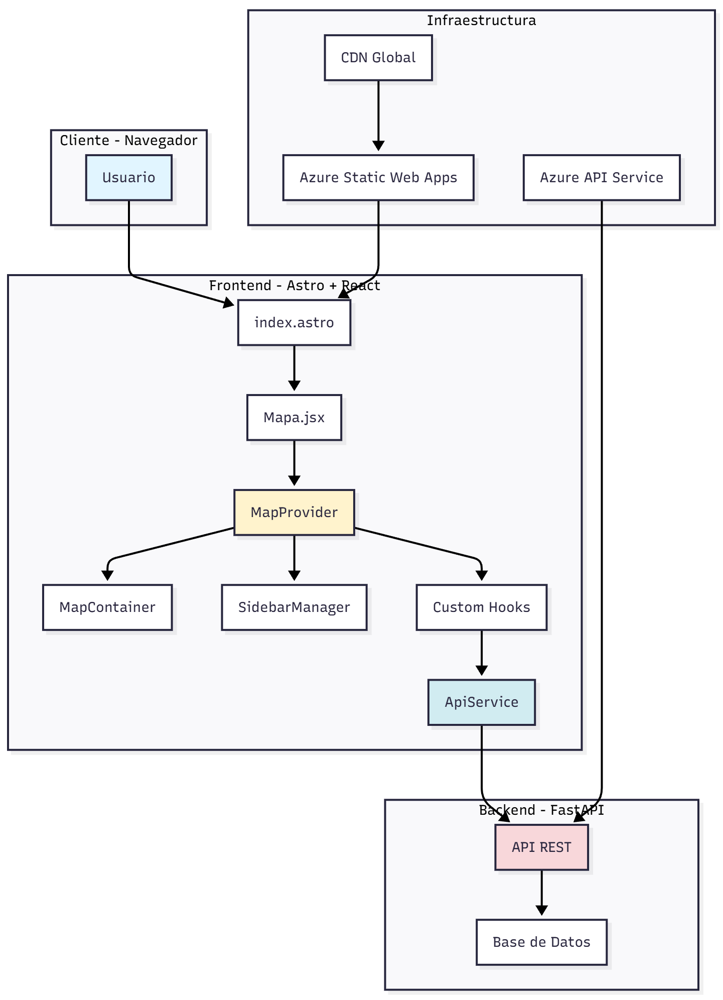

---

## Diagrama de Componentes

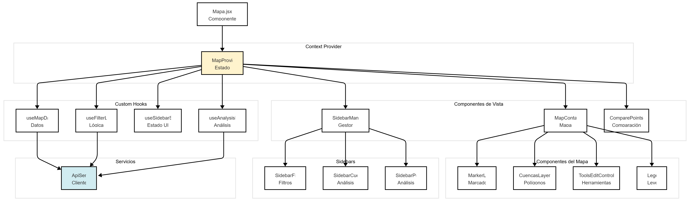

---

## Flujo de Datos

### Inicialización de la Aplicación

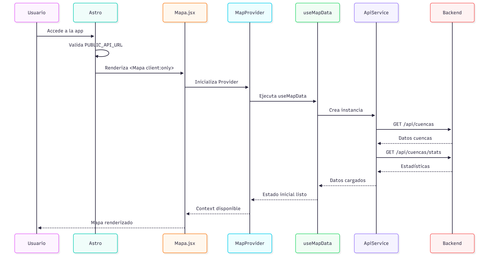

### Flujo de Filtrado

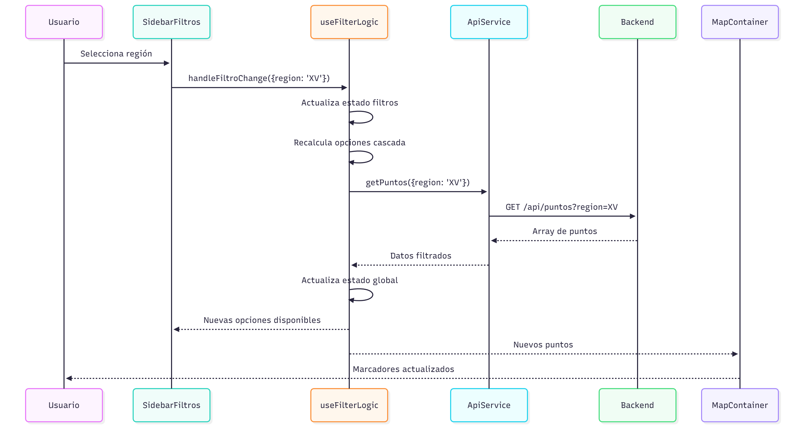

### Flujo de Análisis de Cuenca

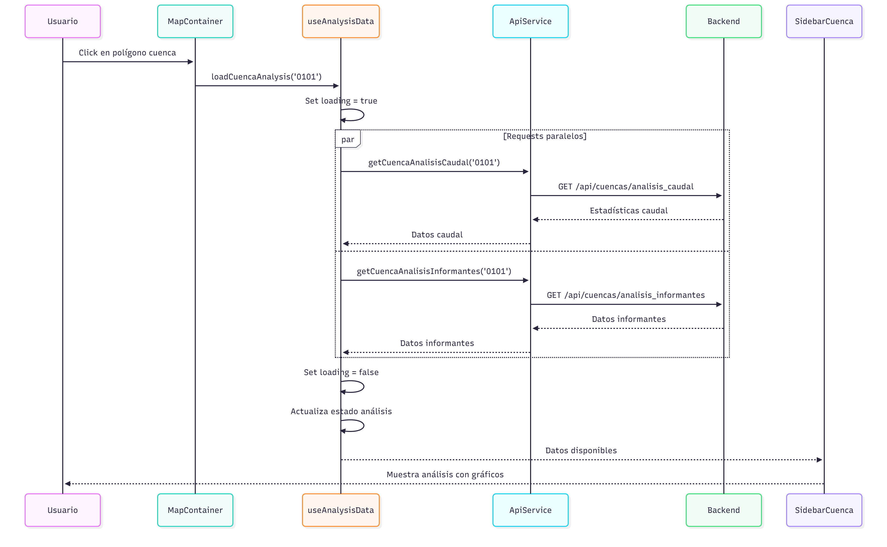

---

## Diagrama de Context API

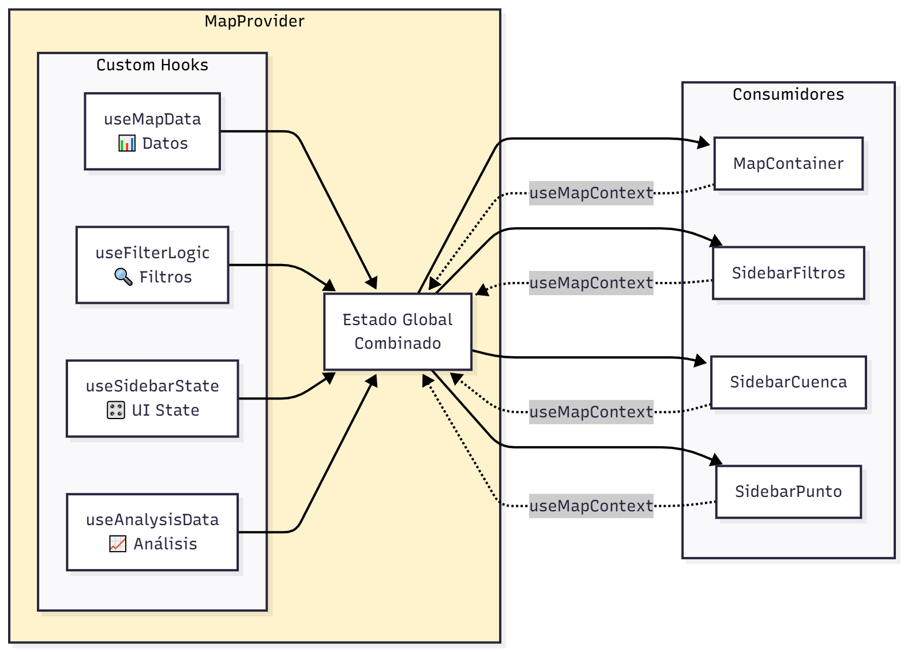

---

## Flujo de Usuario

### User Journey: Filtrar y Analizar Puntos

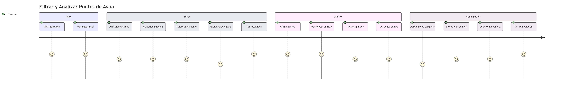

---

## Diagrama de Deployment

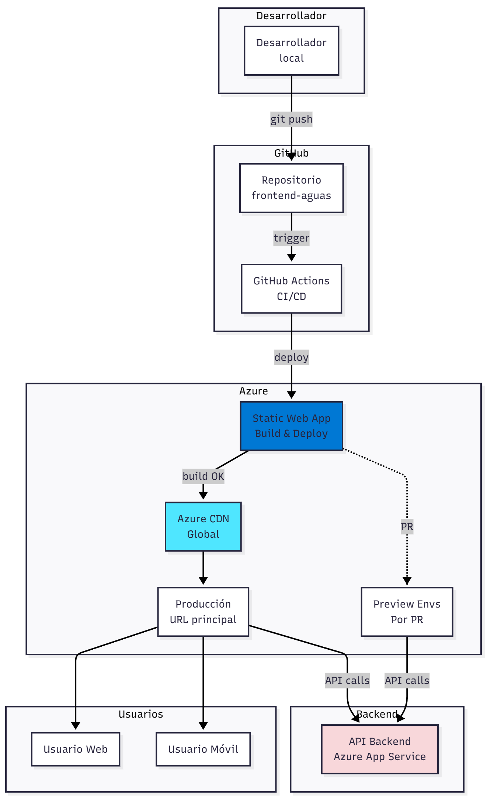

### Pipeline de CI/CD

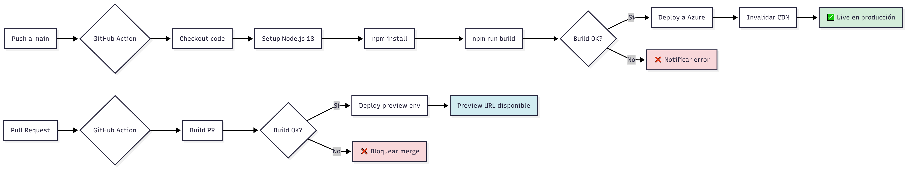

---

## Estructura de Hooks

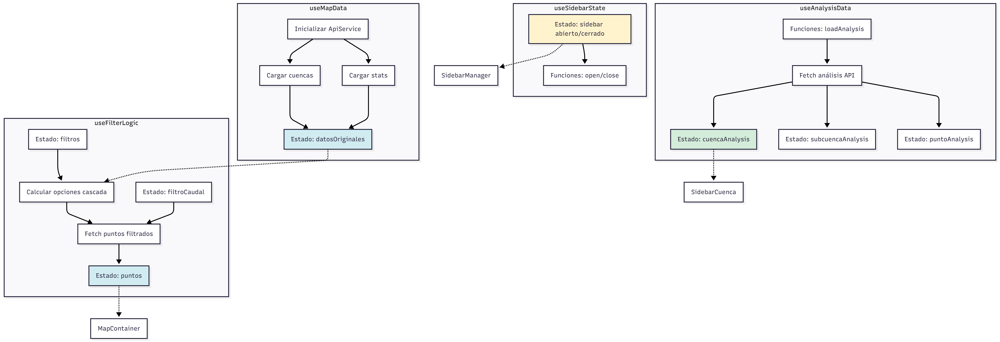

---

## Diagrama de API Requests

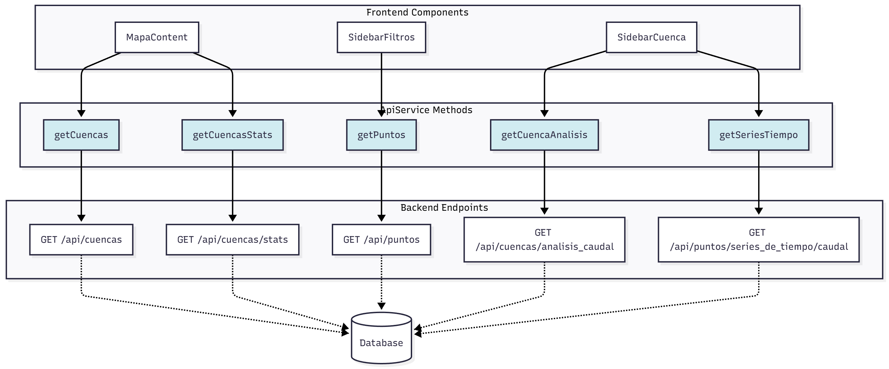

---

## Diagrama de Seguridad

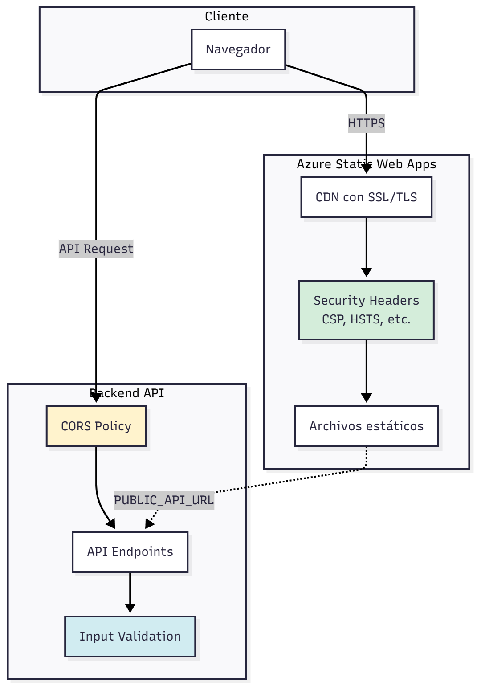

**Medidas de Seguridad:**
- ✅ HTTPS enforced (HSTS)
- ✅ Content Security Policy (CSP)
- ✅ X-Frame-Options: DENY (anti-clickjacking)
- ✅ X-Content-Type-Options: nosniff
- ✅ CORS configurado en backend
- ✅ Input sanitization (DOMPurify)
- ✅ Request timeout (30s)

---

## Cómo Usar Estos Diagramas

### Ver en GitHub
Los diagramas Mermaid se renderizan automáticamente en GitHub. Solo abre este archivo.

### Exportar como Imagen
1. Usa [Mermaid Live Editor](https://mermaid.live)
2. Copia y pega el código del diagrama
3. Exporta como PNG o SVG

### Editar Diagramas
- Editor online: https://mermaid.live
- VSCode extension: Mermaid Preview
- Sintaxis: https://mermaid.js.org/

---

**Última actualización:** Noviembre 2025
