# 📊 Diagramas del Sistema

Esta carpeta contiene diagramas visuales de la arquitectura y flujos del proyecto **Aguas Transparentes Frontend**.

Todos los diagramas están en formato **Mermaid** que GitHub renderiza automáticamente.

## Tabla de Contenidos

- [Diagrama de Arquitectura General](#diagrama-de-arquitectura-general)
- [Diagrama de Componentes](#diagrama-de-componentes)
- [Flujo de Datos](#flujo-de-datos)
- [Diagrama de Context API](#diagrama-de-context-api)
- [Flujo de Usuario](#flujo-de-usuario)
- [Diagrama de Deployment](#diagrama-de-deployment)
- [Estructura de Hooks](#estructura-de-hooks)

---

## Diagrama de Arquitectura General

---

## Diagrama de Componentes

---

## Flujo de Datos

### Inicialización de la Aplicación

### Flujo de Filtrado

### Flujo de Análisis de Cuenca

```mermaid
sequenceDiagram
    participant U as Usuario
    participant Map as MapContainer
    participant A as useAnalysisData
    participant API as ApiService
    participant B as Backend
    participant SC as SidebarCuenca

    U->>Map: Click en polígono cuenca
    Map->>A: loadCuencaAnalysis('0101')
    A->>A: Set loading = true

    par Requests paralelos
        A->>API: getCuencaAnalisisCaudal('0101')
        API->>B: GET /api/cuencas/analisis_caudal
        B-->>API: Estadísticas caudal
        API-->>A: Datos caudal
    and
        A->>API: getCuencaAnalisisInformantes('0101')
        API->>B: GET /api/cuencas/analisis_informantes
        B-->>API: Datos informantes
        API-->>A: Datos informantes
    end

    A->>A: Set loading = false
    A->>A: Actualiza estado análisis
    A-->>SC: Datos disponibles
    SC-->>U: Muestra análisis con gráficos
```

---

## Diagrama de Context API

```mermaid
graph LR
    subgraph "MapProvider"
        style MapProvider fill:#fff3cd

        subgraph "Custom Hooks"
            H1[useMapData<br/>📊 Datos]
            H2[useFilterLogic<br/>🔍 Filtros]
            H3[useSidebarState<br/>🎛️ UI State]
            H4[useAnalysisData<br/>📈 Análisis]
        end

        Estado[Estado Global<br/>Combinado]
    end

    subgraph "Consumidores"
        C1[MapContainer]
        C2[SidebarFiltros]
        C3[SidebarCuenca]
        C4[SidebarPunto]
    end

    H1 --> Estado
    H2 --> Estado
    H3 --> Estado
    H4 --> Estado

    Estado --> C1
    Estado --> C2
    Estado --> C3
    Estado --> C4

    C1 -.->|useMapContext| Estado
    C2 -.->|useMapContext| Estado
    C3 -.->|useMapContext| Estado
    C4 -.->|useMapContext| Estado
```

---

## Flujo de Usuario

### User Journey: Filtrar y Analizar Puntos

---

## Diagrama de Deployment

### Pipeline de CI/CD

---

## Estructura de Hooks

---

## Diagrama de API Requests

---

## Diagrama de Seguridad

**Medidas de Seguridad:**
- ✅ HTTPS enforced (HSTS)
- ✅ Content Security Policy (CSP)
- ✅ X-Frame-Options: DENY (anti-clickjacking)
- ✅ X-Content-Type-Options: nosniff
- ✅ CORS configurado en backend
- ✅ Input sanitization (DOMPurify)
- ✅ Request timeout (30s)

---

## Cómo Usar Estos Diagramas

### Ver en GitHub
Los diagramas Mermaid se renderizan automáticamente en GitHub. Solo abre este archivo.

### Exportar como Imagen
1. Usa [Mermaid Live Editor](https://mermaid.live)
2. Copia y pega el código del diagrama
3. Exporta como PNG o SVG

### Editar Diagramas
- Editor online: https://mermaid.live
- VSCode extension: Mermaid Preview
- Sintaxis: https://mermaid.js.org/

---

**Última actualización:** Noviembre 2025
